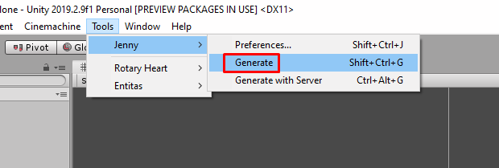

# ECS

Osnowa uses Entities-Components-Systems architecture at its core to maintain the actors in the game.


_Source: http://cowboyprogramming.com/2007/01/05/evolve-your-heirachy/_

If you're not familiar with ECS concept, a short explanation is that it's about moving away from some traits of OOP in favor of data-composition, which is especially useful in games with complicated logic such as roguelikes. For minimal basics watch this introductory video: https://www.youtube.com/watch?v=2rW7ALyHaas

Osnowa's ECS is based on Entitas. After learning its basics from this document, please refer to [Entitas](https://github.com/sschmid/Entitas-CSharp) for further information.

A typical actor (entity) in Osnowa consists of:
- its `GameEntity`, which is made of a set of components
- its **GameObject**, which is a representation of the entity in presentation layer (which is Unity).

# Components

Components are simple data-holding classes like these ones:
``` csharp
[Serializable]
public class StomachComponent : IComponent
{
	public int Satiation;
	public int MaxSatiation;
}

[Serializable]
public class AggressiveComponent : IComponent
{

}
```

Basing on all the components defined, Entitas generates a GameEntity class consisting of many partial classes. Each partial class defines properties and methods related to single component.

This is how you manipulate the components:

``` csharp
bool hasStomach = someEntity.hasStomach; // false

someEntity.AddStomach(newSatiation: 100, newMaxSatiation: 100);
int entitySatiation = someEntity.stomach.Satiation; // 100

// when time passes:
someEntity.ReplaceStomach(someEntity.stomach.Satiation - 1, someEntity.stomach.Satiation);

// if the entity has been blessed (or cursed) to never be hungry, we can do this:
someEntity.RemoveStomach();

// if a component doesn't hold any data, you can use it in this way:
bool isAggressive = someEntity.isAggressive; // false
someEntity.isAggressive = true;
```

# Systems

Systems define logic which processes the components.

Take a look at `HungerSystem`. If you know Entitas, this will be familiar for you.

``` csharp
public class HungerSystem : ReactiveSystem<GameEntity>
{
    public HungerSystem(IContext<GameEntity> context) 
        : base(context)
    {
    }

    // Defines a "collector", which is telling Entitas what are the components that are required for an entity to execute this system. In this case an entity has to have stomach and it must have received its turn to act.
    protected override ICollector<GameEntity> GetTrigger(IContext<GameEntity> context)
    {
        return context.CreateCollector(GameMatcher.AllOf(GameMatcher.Stomach, GameMatcher.ExecutePreTurn));
    }

    // Checks if the entity has the required components.
    protected override bool Filter(GameEntity entity)
    {
        return entity.hasStomach && entity.isExecutePreTurn;
    }

    // Contains the actual logic. It works on a list of entities, however usually it will contain only one element. That's related to the fact that in turn-based games entities act simultanously.
    protected override void Execute(List<GameEntity> entities)
    {
        foreach (GameEntity entity in entities)
        {
            entity.ReplaceStomach(entity.stomach.Satiation - 1, entity.stomach.MaxSatiation);
        }
    }
}
```

So, when is `Execute()` called?

Entitas systems are organised into `Feature` classes:
* The main one at the moment is `PerInitiativeFeature`, which groups systems to run when an entity receives its turn. `TurnManager` class calls `_perInitiativeFeature.Execute();` once per turn of each entity. This will trigger `Execute()` on all systems contained in the Feature.
* There is also `ReactiveFeature` which is supposed to contain systems that should handle changes in components _during a turn_. It contains eg. `ReceiveDamageSystem` because if an entity receives damage that would destroy it, the engine should wait with destruction until the entity will get its turn.
* `RealTimeFeature` is not used at the moment in Osnowa, but it wouldn't be hard to plug it to the engine flow in order to run some systems in real-time, for example once per `Update()` call on some **GameObject**.

# Creating your own components

* In .../Osnowa.Example/ECS create a folder for your feature. Inside create a class deriving from `IComponent` and add fields or properties with your data.
* Make sure your code compiles and run Entitas code generator (Jenny) in Unity:  
  
* In Assets/Scripts/Generated/Components should appear a new file with a partial GameEntity class for your component.
