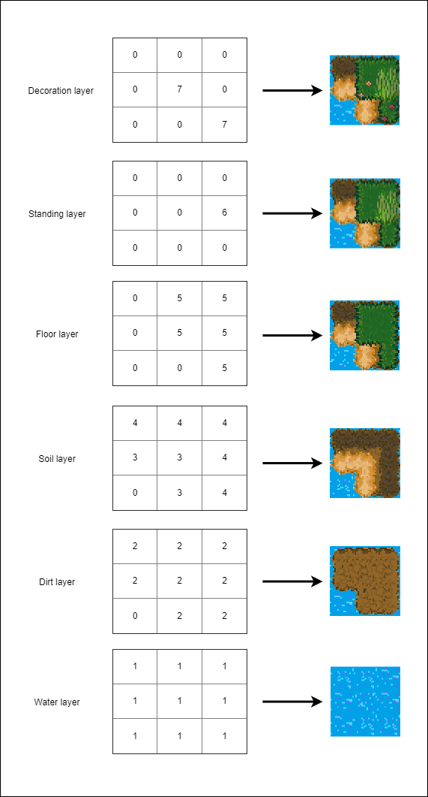

# Tiles

The tilemap is stored on Osnowa side in two-dimensional arrays, one per each layer:
``` csharp
public interface IOsnowaContext
{
    ...
    MatrixByte[] TileMatricesByLayer { get; }
    ...
}
```

Tiles are identified by unique IDs. They are stores as `byte` values, so if you want to use more than 256 different tiles, you have to change the matrix type.

```
context.TileMatricesByLayer[TilemapLayers.Standing].Set(3, 4, treeTile.Id);
```

Tiles are organised into layers. Each layer is dedicated for different types of tiles, for example water (seas, lakes, rivers), soil (swamp, sand or well, soil), floor tiles (grass, roads, floors), standing tiles (trees, bushes, barrels, furniture), decoration tiles (fog, flowers etc.). A layer can have exactly one tile at given position.
In Osnowa.Unity, each layer corresponds to one Unity Tilemap object in the scene. 



# Updating tiles

When tile data is updated in `TileMatricesByLayer[]`, two things should follow afterwards:
1. `PositionFlags` should be also changed, so that the walkability and light passability at given position are updated.
2. The actual tilemap in presentation layer (eg. Unity tilemap) should be updated, so that the changes are visible.

That's why you should rather not access `TileMatricesByLayer` directly but use `ITileMatrixUpdater`, which is ment to take care of all of these updates:
```tileMatrixUpdater.Set(position, tileToSet);```
